# Implementation Evidence

Screenshots captured from the actual local/AWS implementation of this Node.js Microservice project.

## Repository Structure

```text
nodejs-microservice/
├── README.md
├── screenshots/
│   ├── 01-monitoring/
│   ├── 02-aws-infrastructure/
│   ├── 03-ci-cd/
│   ├── 04-docker/
│   ├── 05-terraform/
│   ├── 06-aws-cli-iam/
│   ├── 07-application/
│   └── 08-soc-lab/
└── docs/
    └── IMPLEMENTATION-EVIDENCE.md
```

## 1. Application Monitoring

### Grafana Dashboard
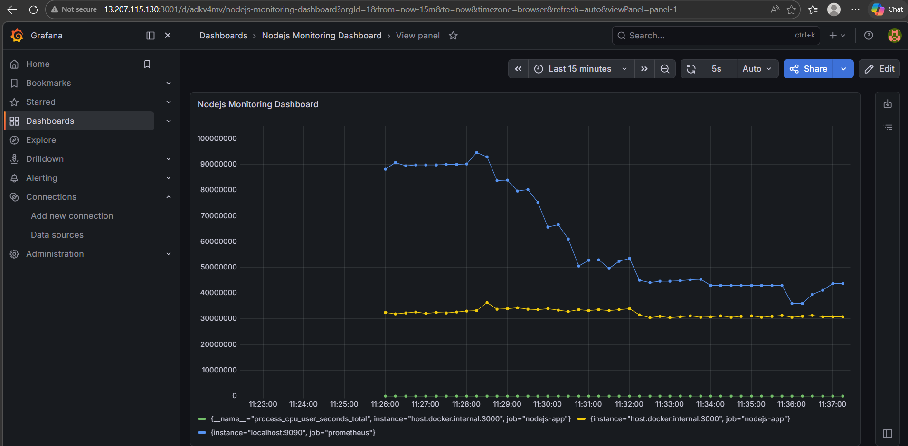

### Prometheus Targets
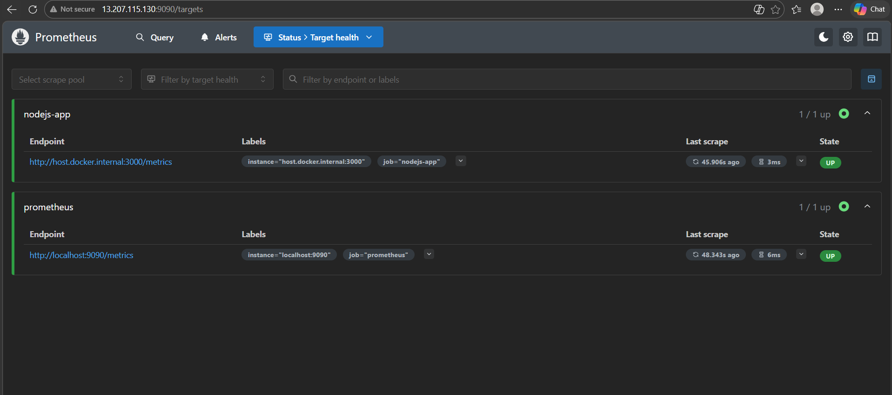

### Node.js Metrics
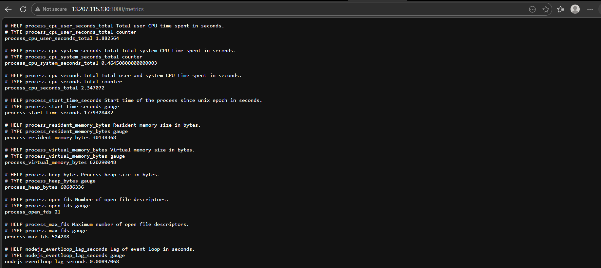

### AWS CloudWatch
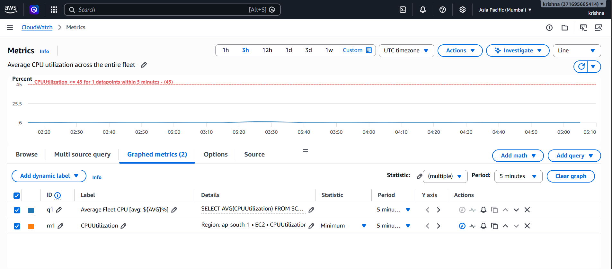

## 2. AWS Infrastructure

### EC2 Running
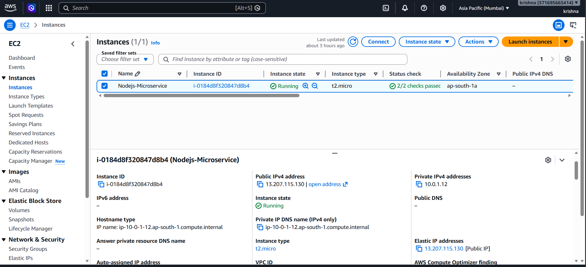

### EC2 Deployment
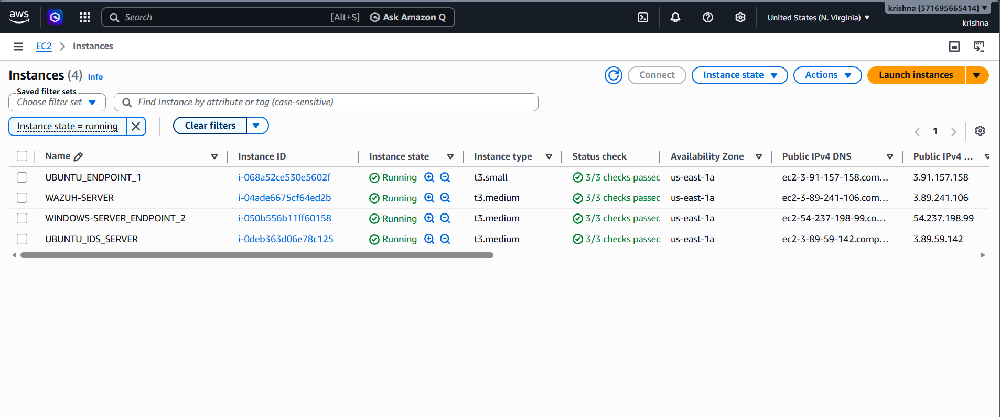

## 3. CI/CD

### GitHub Actions Successful Deployment
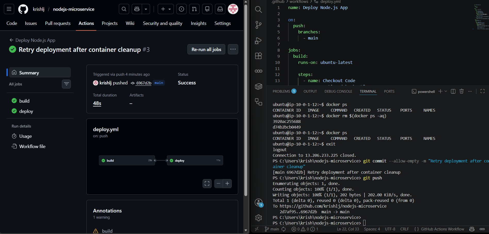

### GitHub Actions Build
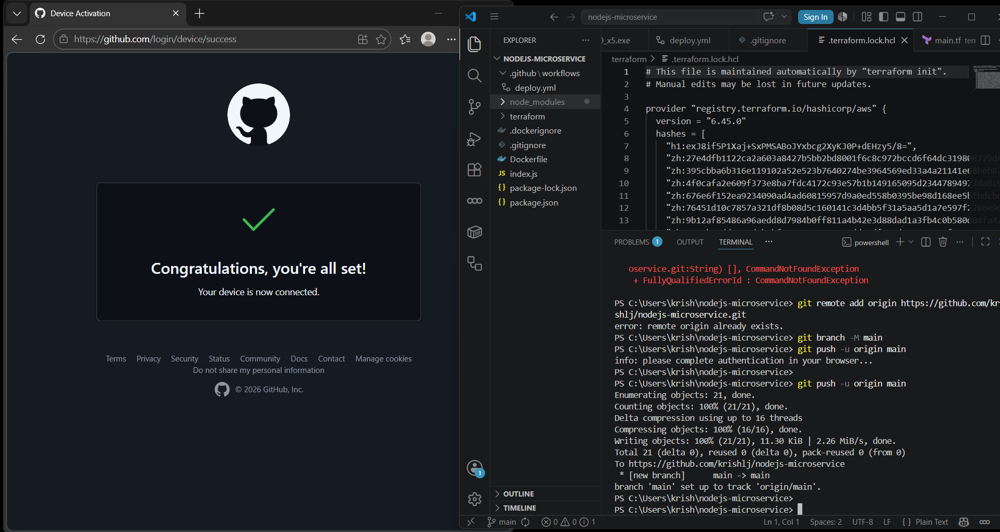

## 4. Docker

### Dockerfile and Build
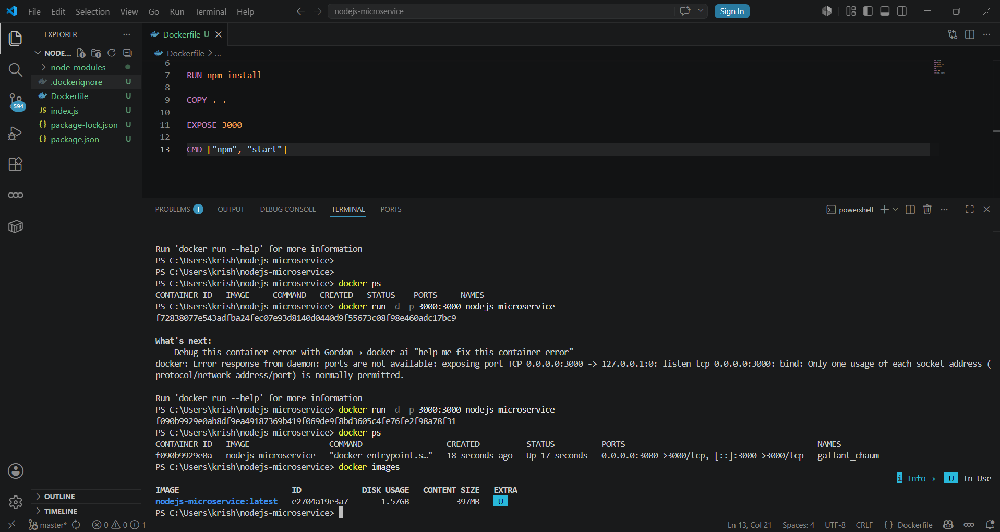

### Docker Login
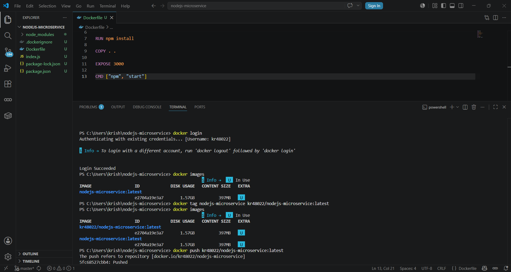

### Docker Image Pushed to Docker Hub
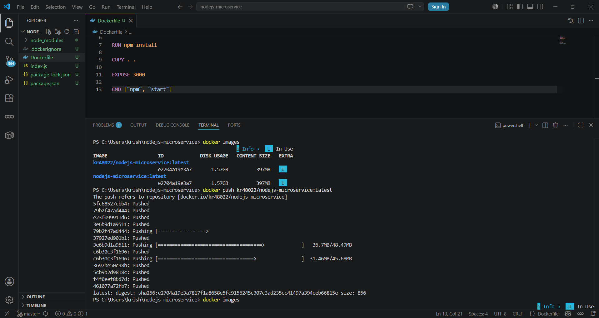

### Docker Container
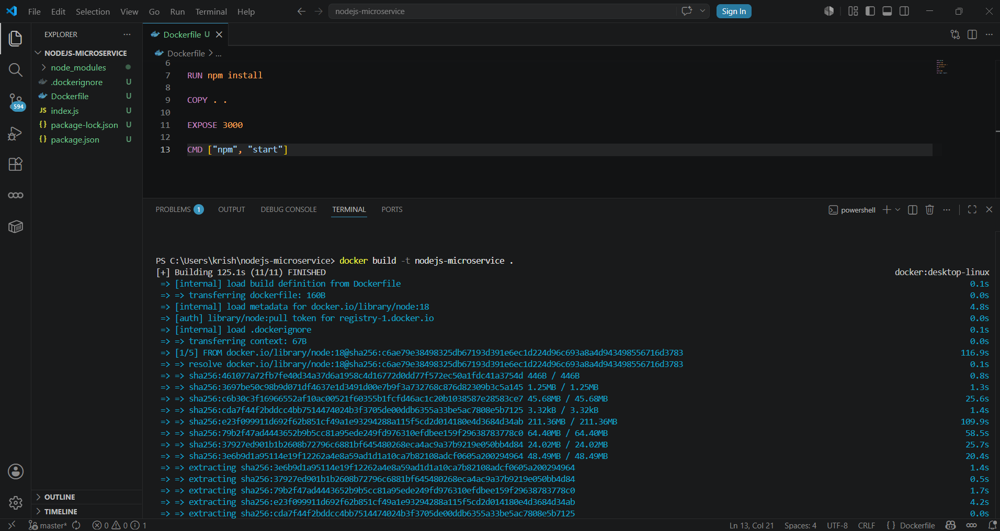

### Docker Pulled and Running on EC2
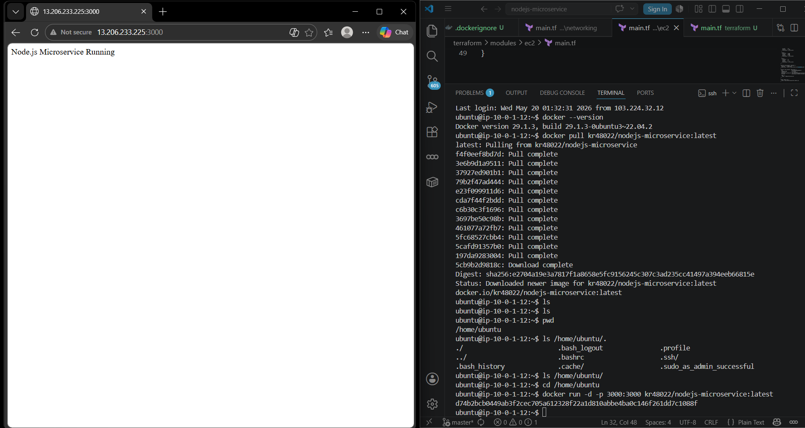

## 5. Terraform

### Terraform Initialization
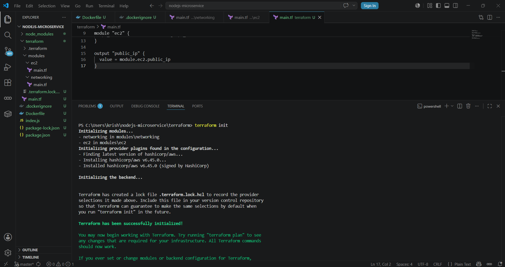

### Terraform Validation
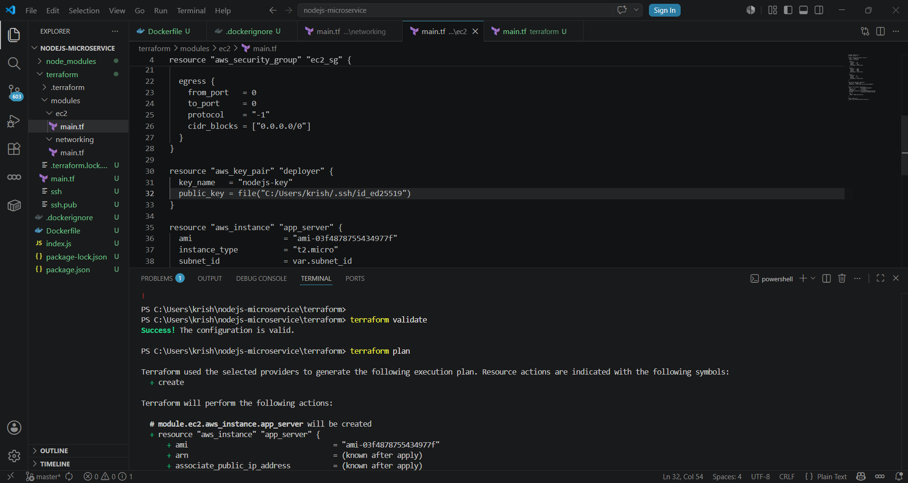

## 6. AWS CLI and IAM

### AWS CLI Connected with IAM
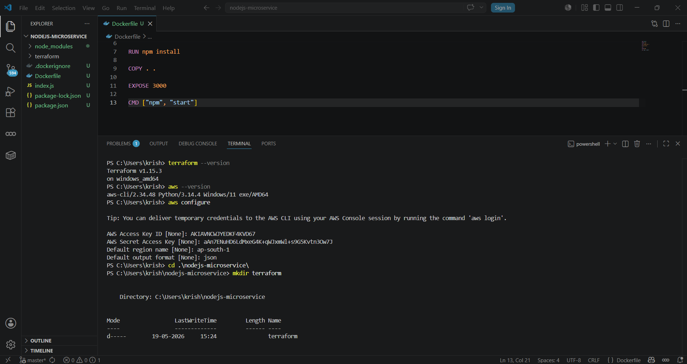

### IAM User
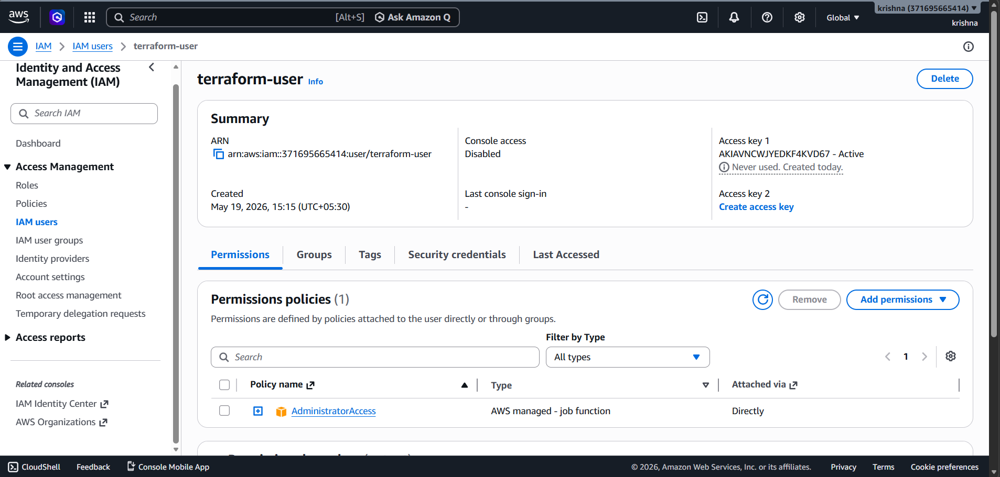

## 7. Node.js Application

### Node.js Microservice Running
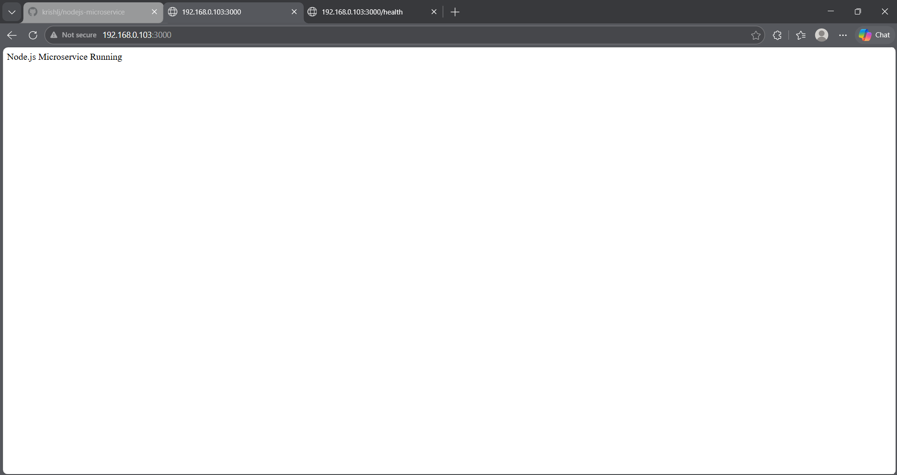

## 8. SOC Lab

### Wazuh SOC Dashboard
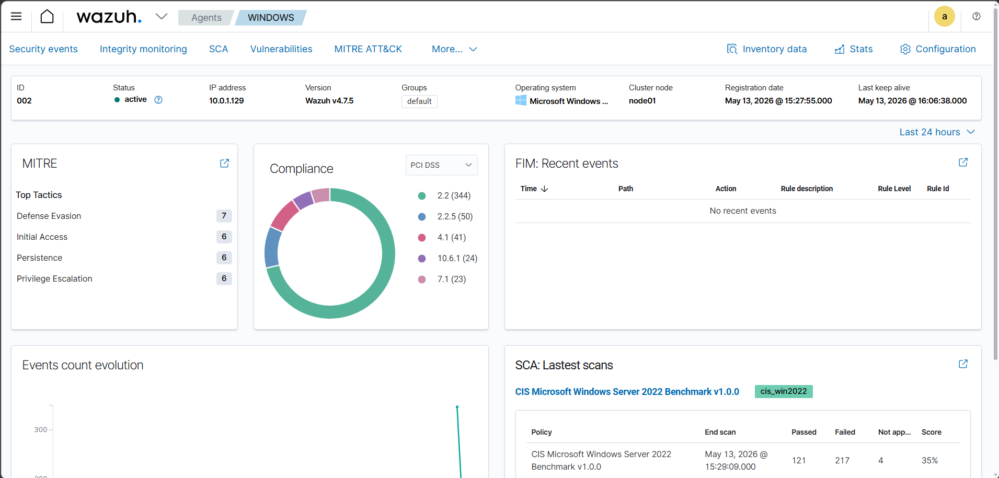

### AWS SOC Lab Topology
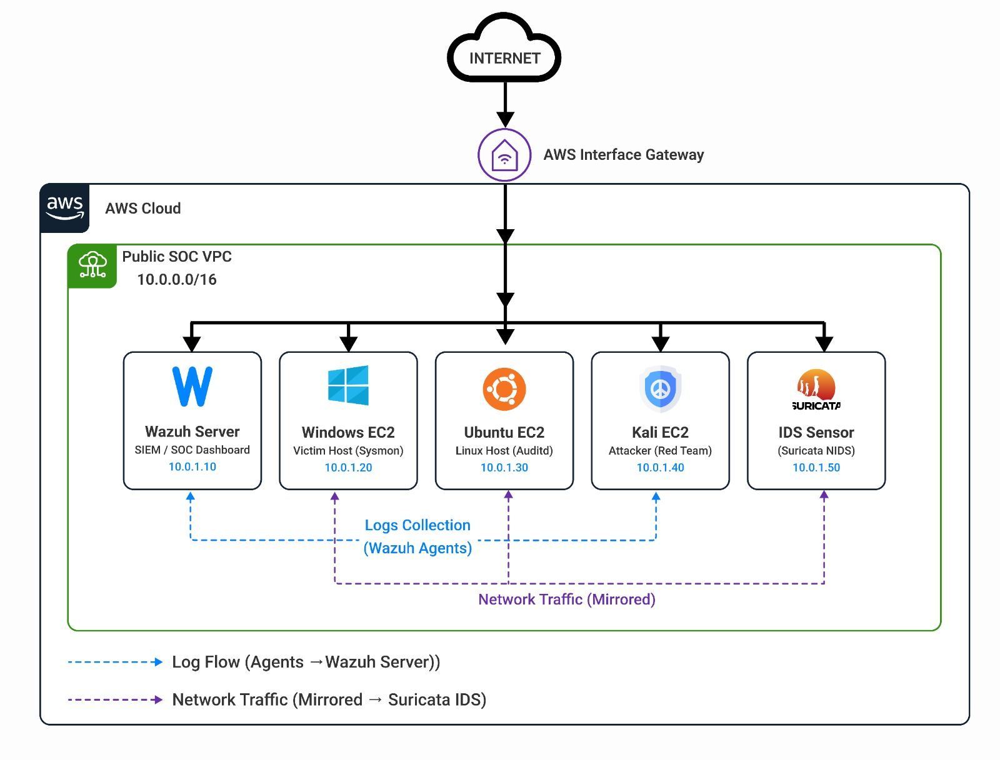

> These screenshots are implementation evidence from the author's local development and AWS lab environments. IP addresses and environment-specific values may differ when reproducing the project.
